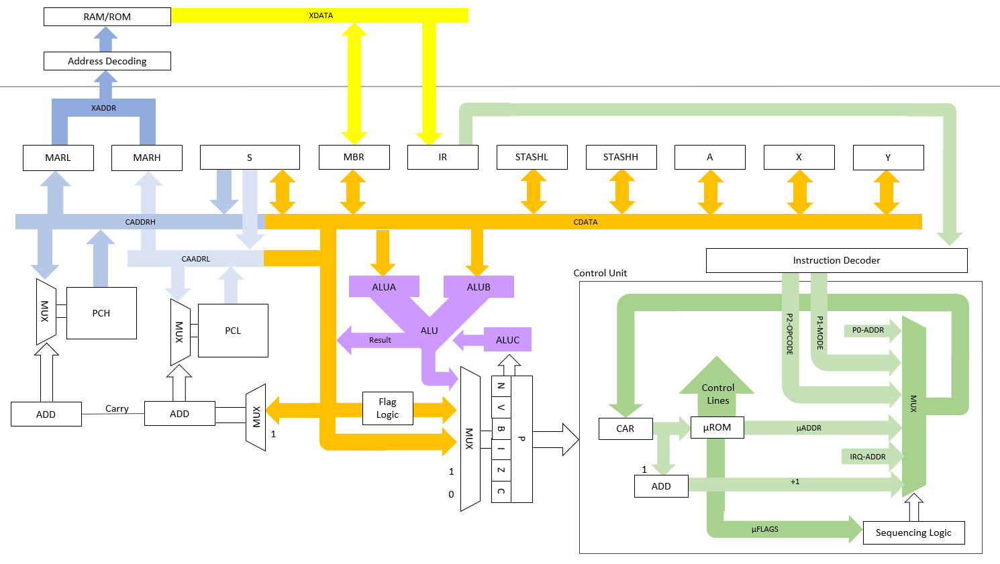

# DIY CPU

This project is a learning exercise in digital electronics, with goals to:

* Design a CPU from the ground up that is op-code compatible with the [6502](https://archive.org/details/mos_microcomputers_programming_manual).
* Implement and validate the design in a digital circuit simulator.
* Implement the design physically, primarily using the [7400](https://en.wikipedia.org/wiki/7400-series_integrated_circuits) series of ICs.

* The design is documented [here](docs/architecture/index.md).
* Build/execution instructions are available [here](docs/build-and-run.md).
* Current status is described [here](docs/status.md).

## Simplified Version

I've created a simplified version of the design - adhering to the same design principles as the full version but scaling back to make building the circuit a more practical proposition.  This is design is documented [here](docs/simplified/index.md).