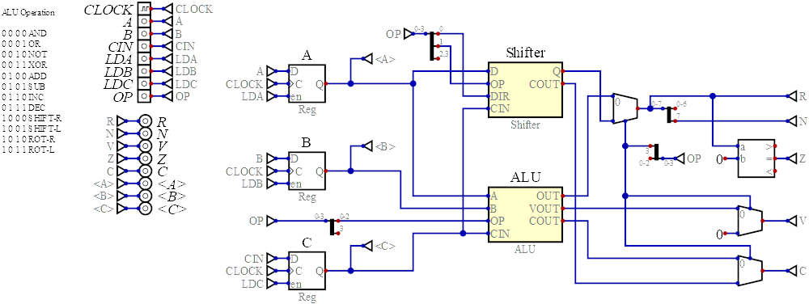
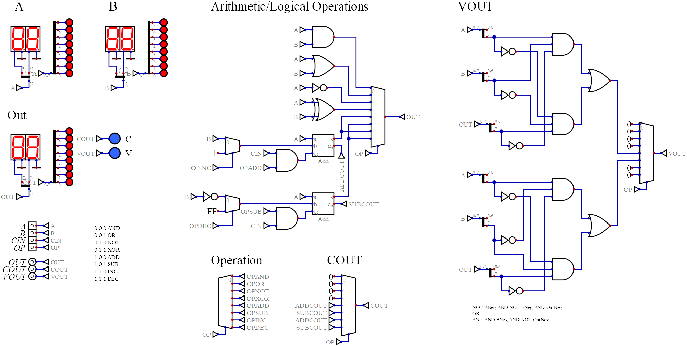
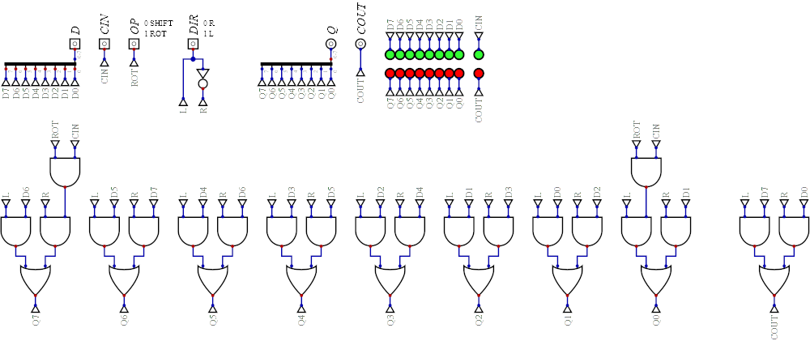

# ALU

The *Arithmetic Logic Unit* (ALU) provides arithmetic operations, logical operations,  shift and rotate operations to the CPU.

The ALU is divided into three modules:

* *Registers* - Registers that latch input values for the other two modules.
* *ALU-proper* - Arithmetic and logic operations.
* *Shifter* - Shift and rotate operations.

# ALU

The ALU fronts the *ALU-proper* and the *Shifter* with three registers.

The `A` and `B` registers hold the main 8 bit ALU operands and `C` holds an input carry bit.

## Inputs

The latched ALU has the following inputs:

* `CLOCK` - System clock
* `A` - `A` operand
* `B` - `B` operand
* `C` - `C` Carry input
* `LDA` - Set high to load `A`
* `LDB` - Set high to load `B`
* `LDC` - Set high to load `C`
* `OP` - Selects the ALU operation as follows:

    | Value  | Operation      |
    | ------ | -------------- |
    | `0000` | And            |
    | `0001` | Or             |
    | `0010` | Not            |
    | `0011` | Xor            |
    | `0100` | Add            |
    | `0101` | Subtract       |
    | `0110` | Increment A    |
    | `0111` | Decrement A    |
    | `1000` | Shift right A  |
    | `1001` | Shift left A   |
    | `1010` | Rotate right A |
    | `1011` | Rotate left A  |

    The `OP` is processed and passed on to the *ALU-proper* and the *Shifter*, as well as being use to select the appropriate output signal. 

## Outputs

The latched ALU has the following outputs:

* `R` - The result.
* `N` - Set to indicate a negative output (bit 7 set).
* `V` - Set to indicate an arithmetic overflow.
* `Z` - Set to indicate a zero result.
* `C` - Carry out.
* `<A>` - Debugging output giving the value in `A`.
* `<B>` - Debugging output giving the value in `B`. 
* `<C>` - Debugging output giving the value in `C`.

# ALU Proper

The *ALU-Proper* implements arithmetic and logical operations for the CPU.  It is purely combinational logic.

## Inputs

* `A` - `A` operand
* `B` - `B` operand
* `C` - `C` Carry input
* `OP` - Selects the ALU operation as follows:

    | Value | Operation     |
    | ----- | --------------|
    | `000` | And           |
    | `001` | Or            |
    | `010` | Not `A`       |
    | `011` | Xor           |
    | `100` | Add           |
    | `101` | Subtract      |
    | `110` | Increment `A` |
    | `111` | Decrement `A` |

## Outputs

* `OUT` - The result.
* `COUT` - Carry out.
* `VOUT` - Set to indicate an arithmetic overflow.

# Shifter

The *Shifter* implements shift and rotate operations for the CPU.  It is purely combinational logic.

 

## Inputs

* `D` - Input value.
* `CIN` - Carry in.
* `OP` - Selects the shifter operation as follows:

    | Value | Operation |
    | ----- | --------- |
    | `0`   | Shift     |
    | `1`   | Rotate    |

* `DIR` - Selects the direction of the shift or rotate operation as follows:

    | Value | Operation |
    | ----- | --------- |
    | `0`   | Right     |
    | `1`   | Left      |

## Outputs

* `Q` - Result.
* `COUT` - Carry out.
  

