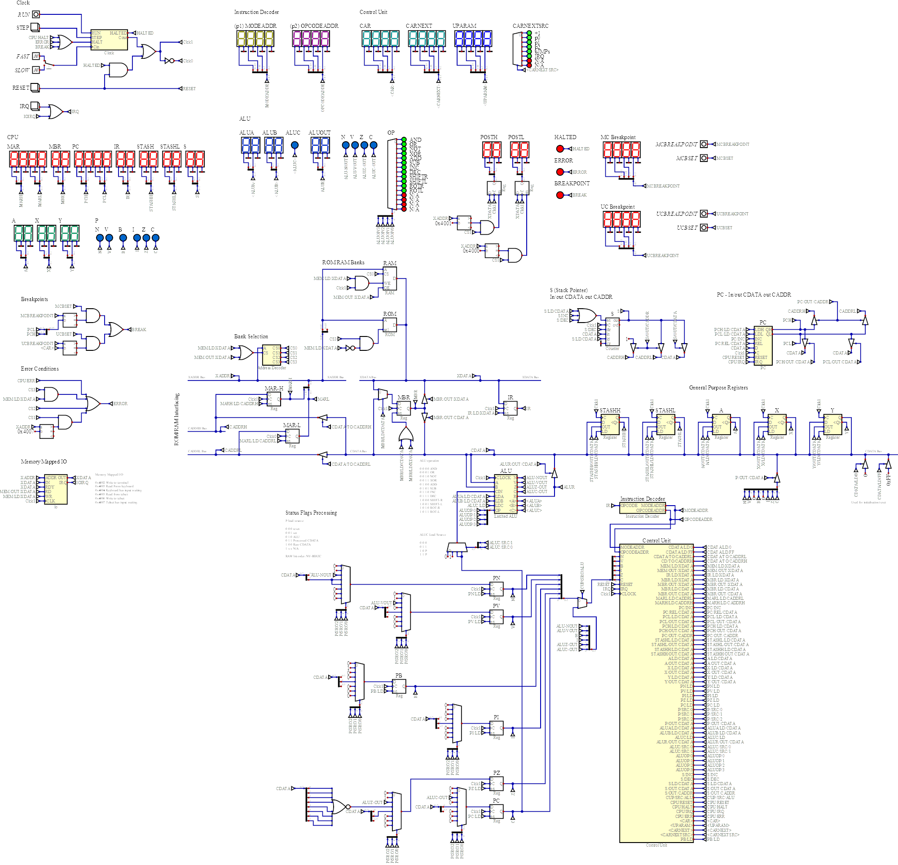

# Overview

The following diagram shows a high level block view of the CPU together with some external components.

* *RAM/ROM* - Program code.
* *Address Decoding* - The [address decoder](address-decoder.md) maps memory addresses onto banks of memory.
* `XADDR` and `XDATA` Buses - The *eXternal ADDRess bus* (`XADDR`) and the *eXternal DATA bus* (`XDATA`) connect the CPU with memory (RAM/ROM) and memory mapped I/O.
* `MARH/MARL` and `MBR` Registers - The *Memory ADDRess High/Low* registers (`MARH/MARL`) target a memory location and the *Memory Buffer Register* (`MBR`) stores data read from/to be written to, memory.
* `IR` *Instruction Register* - The *Instruction Register* (`IR`) stores the currently executing machine code instruction read from memory.
* `CADDRH/CADDRL` Registers - The *Cpu ADDRess High/Low* buses (`CADDRH/CADDRL`) allow memory addresses calculated within the CPU to be transferred to `MARH/MARL`.                                 
* `PCH/PCL` Registers - The [Program Counter High/Low](pc.md) registers (`PCH/PCL`) hold the memory address of the currently executing machine code instruction. 
* `CDATA` Bus - The *Cpu DATA bus* (`CDATA`) allows data transfer within the CPU.  
* `S` *Stack Register* - The *Stack register* (`S`) points to the next free stack location in memory. 
* `P` *Status Register* - The *status register* (`P`) holds CPU status flags, for example the `C` flag which signals carry from a proceeding `ALU` addition. 
* `STASHH`/`STASHL` Internal Registers - Used to store temporary values when processing machine code instructions.
* `A`/`X`/`Y` General Purpose Registers - General purpose registers available to the programmer.
* `ALU` *[Arithmetic Logic Unit](alu.md)* - Arithmetic, logical, shift and rotate operations.
* *Instruction Decoder* - The [instruction decoder](instruction-decoder.md) maps machine code instructions onto µcode routines in the [control unit](control-unit.md).
* *Control Unit* - The [control unit](control-unit.md) orchestrates to operation of the CPU via a set of control lines.

The following shows a more detailed architectural diagram:

Essentially this diagram is the same as the high level block version.   The major additions are the inclusion of control lines driven from the control unit, tri-state buffers to govern bus access and some logic to deal with status flags.

Each of sub-modules of the CPU is described in detail here:

* [ALU](alu.md) - The *Arithmetic/Logic Unit*.
* [Control Unit](control-unit.md) - The *Control Unit*.
* [Address Decoder](address-decoder.md) - The *Address Decoder*.
* [Instruction Decoder](instruction-decoder.md) - The *Instruction Decoder*.
* [Program Counter](pc.md) - The *Program Counter*.
* [Register](register.md) - Stores 8 bit values.

