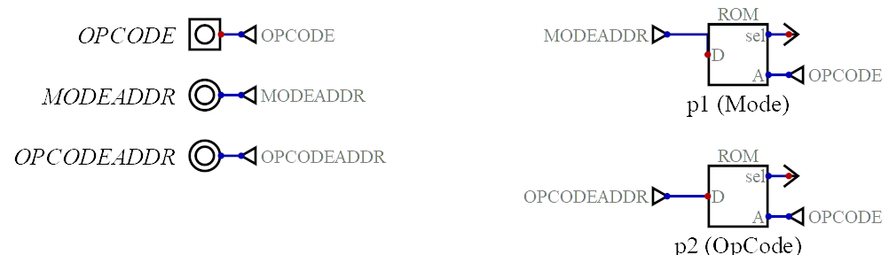

# Instruction Decoder

The instruction decoder processes machine code instructions to locate their associated µcode implementations.

A machine code instruction is presented as a memory address to a decoder ROM.  The decoder ROM is programmed such that the data at this memory location contains the address of the associated µcode routine in the [Control Unit](control-unit.md).  

There are two decoder ROMs:

* `p1 (Mode)` ROM - The `p1 (Mode)` ROM locates µcode that implements the [addressing mode](addressing-modes.md) of the presented machine code instruction.

* `p2 (Opcode)` ROM - The `p2 (Opcode)` ROM locates µcode that implements the presented machine code instruction.

# Inputs

* `OPCODE` - The machine code instruction to decode.

# Outputs

* `MODEADDR` - The address of the µcode implementing the machine code instruction's addressing mode.

* `OPCODEADDR` - The address of the µcode implementing the the machine code instruction.
   