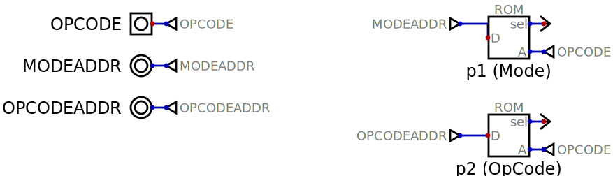

# Instruction Decoder

The instruction decoder processes machine instructions to locate their associated µcode implementations.

A machine code instruction is presented as the address to two ROMs, the referenced data is the address of the relevant µcode in the [Control Unit](control-unit.md).  The two ROMs are as follows:

* `p1 (Mode)` ROM - The `p1 (Mode)` ROM locates µcode that implements the relevant [addressing mode](addressing-modes.md) e.g *Immediate* addressing.
* `p2 (Opcode)` ROM - The `p2 (Opcode)` ROM locates µcode that implements the particular opcode e.g. `LDA #AC`

# Inputs

* `OPCODE` - The machine code instruction to decode.

# Outputs

* `MODEADDR` - The address of the µcode implementing the machine code instructions addressing mode.
* `OPCODEADDR` - The address of the µcode implementing the opcode.
   