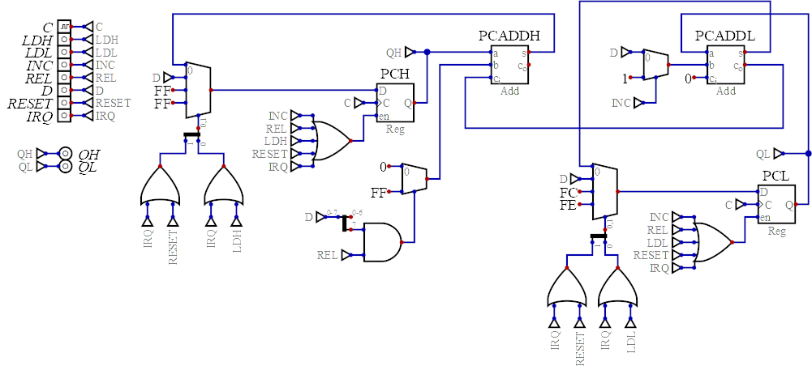

# Program Counter

The *Program Counter* (`PC`) holds the 16 bit address of the current/next machine code instruction.

The circuit allows the PC to be incremented, to be adjusted by a two's complement 8 bit value (to implement relative branches), to load a supplied value (e.g. for absolute jumps) and to load constant values for the interrupt vector (`0xFFFE`) and the reset vector (`0xFFFC`).

# Inputs

* `C` - System clock.
* `LDH` - Set to load the high byte of the `PC` from `D`.
* `LDL` - Set to load the low byte of the `PC` from `D`.
* `INC` - Increment the `PC`.
* `REL` - Adjust the `PC` via `D` as a 8 bit two's compliment value.
* `D` - Incoming data for `LDH`, `LDL` and `REL`.
* `RESET` - Load the reset vector.
* `IRQ` - Load the `IRQ` vector.

# Outputs

* `QH` - `PC` high byte.
* `QL` - `PC` low byte.

