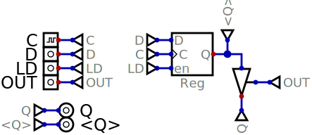

# Register

The register stores a single 8 bit value and has a tri-state output.

# Inputs

* `C` - System clock.  Value is stored on the rising clock edge.
* `D` - Data value to store.
* `LD` - Set high to load a value.
* `OUT` - Set to output value.

# Outputs

* `Q` - Output value when `OUT` is high.
* `<Q>` - Debugging output always giving current value (prior to the tri-state buffer).

